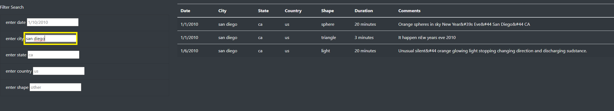
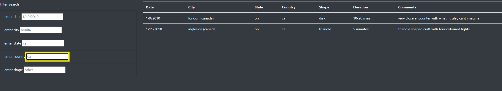
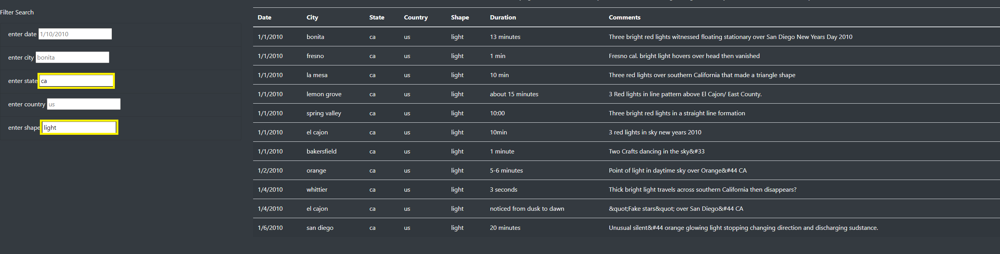
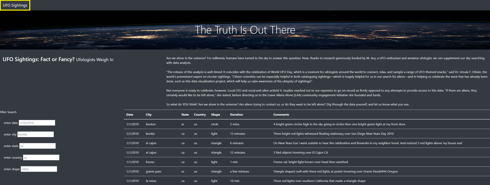
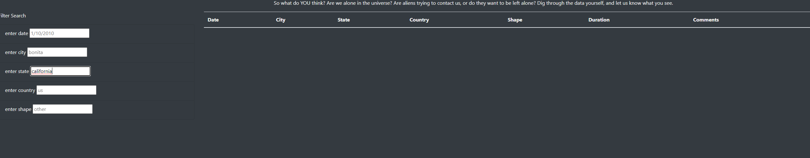

# UFOs
## Project Overview

The purpose of this assignment was to creata dynamic webpage that allows the user to filter through a table of data with UFO sigthing information to perform analysis. The user can filter through the data, but inputing their criteria in one, or more, of the input boxes: date, city, state, country, and shape.

## Results

### Link to UFO Data Webpage

https://rickystuart1.github.io/UFOs/

### Search Process

#### Filter by City

To filter by city, you type in which city from the table that you want to look for into the input box labeled 'enter city' and tap anywhere on the screen or press enter on you keyboard.

#### Filter by Country

To filter by country, you do the same process listed above but you input the country name you are looking for into the 'enter country' input box.

#### Filter by State and Shape

To filter by more than one criteria, just enter data into the input boxes you want to filter for and click anywhere on the screen or press enter on your keyboard.

#### Reset Filters

To reset filter you can either delete the filters you have applied and click enter on your keyboard or press the 'UFO SIghtings' button on the top left of the screen.

## Summary

### Drawbacks
- The data is very limited to events that occured in a two week period, so it would not be a very good resource for an analysis. 
- Filter input is case sensitive and limited to state and country abbrevations (ca vs california) which a user might not realize and think there is no data for their search criteria. 

### Ideas

- Add pages for the data, so the user can go through 20 rows of data and then click to the next page to avoid being overwhelmed with so many rows of data. 

- Add drop down filters on the table on each column with the available data to filter. And when one is selected, remove data that no longer fits the search from other columns' drop down filters. This would help keep the user from combing through the data to figure out what they want to filter for. 

- Add a range for the data filter, so a user can look at data from more than one day. 

